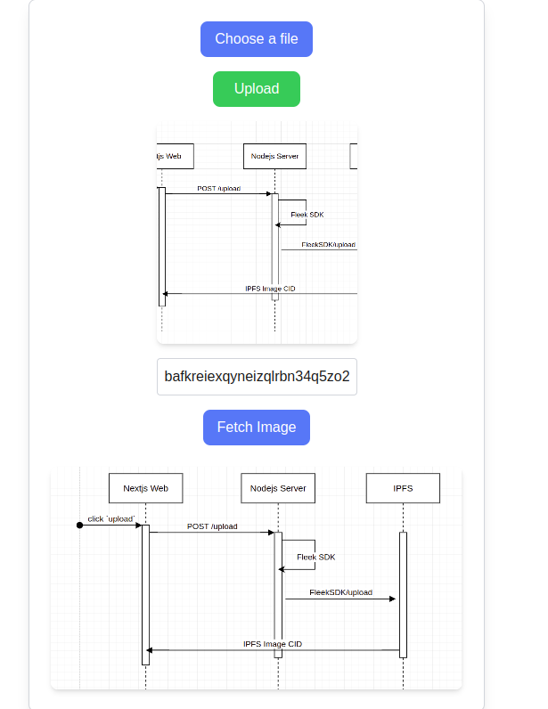

## Project Description



This is a web application using Nextjs, Fleek SDK + CLI, IPFS Storage.

It allows users to upload images to IPFS via Fleek SDK

It is deployed by using fleek-next CLI https://github.com/fleek-platform/fleek-next

This is a [Next.js](https://nextjs.org) project bootstrapped with [`create-next-app`](https://nextjs.org/docs/app/api-reference/cli/create-next-app).

# FE: Nextjs Web

## Get the project id

```bash
fleek projects create --name fleek-ipfs-uploader

✅ Success! The project "fleek-ipfs-uploader" has been successfully created with the project ID "cm2css5d1000tgqiqz5wd9iaa", and you've automatically been switched to it.
```

## fleek.json file

create fleek.json and update `FLEEK_PROJECT_ID`

```bash
{
    "FLEEK_PROJECT_ID": "cm2css5d1000tgqiqz5wd9iaa"
}
```

## Get Fleek Personal Access Token (PAT)

```bash
fleek pat create
```

## Update FE .env file

```bash
# In `fe` working directory
cp .env.local.example .env.local

# Update following environment variables in `.env`
# Fleek personal access token
PAT_TOKEN=
# Fleek project id
PROJECT_ID=
```

## Run the FE on local

```bash
npm run build
npm run dev
```

After running the Nextjs FE on local, the web service runs on [http://localhost:3000](http://localhost:3000)

```
> fleek-ipfs-uploader@0.1.0 dev
> next dev
  ▲ Next.js 14.2.15
  - Local:        http://localhost:3000
  - Environments: .env.local
 ✓ Starting...
 ✓ Ready in 2.1s
```

# BE: Nodejs Webserver

### Setup

```
# Prerequisites
Node 18+
Fleek Account
Fleek CLI
Fleek SDK Installation
```

```bash
# Change current directory to `be`
cd be

# Install dependencies
npm i

# Create `.env` file
cp .env.example .env
# Update following environment variables in `.env`
# Fleek personal access token
PAT_TOKEN=
# Fleek project id
PROJECT_ID=

# Start the nodejs server (in `be` working directory)
node server.js
# Server is running on http://127.0.0.1:8080
```

### Ngok installation for Nodejs deployment

[ngrok](https://ngrok.com/download)

[ngrok signup](https://dashboard.ngrok.com/signup)

```bash
# add auth token to ngrok, can be get here:
# https://dashboard.ngrok.com/get-started/your-authtoken
ngrok config add-authtoken <your_ngrok_auth_token>
#✅ Authtoken saved to configuration file: ~/.config/ngrok/ngrok.yml

# Start the ngrok server
ngrok http 8080

#forwarding: <ngrok_url_to_the_server> (e.g. https://36b3-104-28-254-75.ngrok-free.app) -> http://localhost:8080

```

### Update BACK_END_URL in `fe` folder

After starting up the ngrok, it returns a http url like [https://36b3-104-28-254-00.ngrok-free.app](https://36b3-104-28-254-00.ngrok-free.app)

Go to `fe/app/page.tsx` and update `BE_SERVER_URL`

```code
7 const BE_SERVER_URL = <ngrok_url_to_the_server>;
```

# Deploy Nextjs Web using Fleek-next CLI

```bash
# fleek-next CLI Installation
#global installation
npm i -g @fleek-platform/next

fleek-next deploy
```
